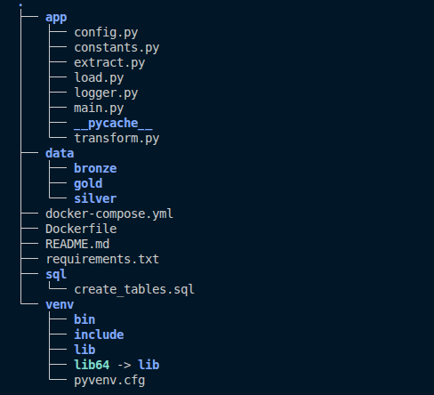
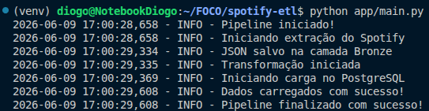
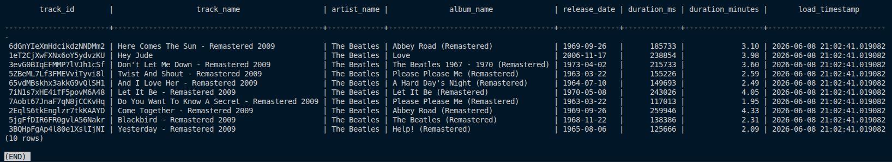

# Spotify ETL Pipeline

Projeto de Engenharia de Dados desenvolvido para coletar informações da Spotify API, processar os dados através de um pipeline ETL e disponibilizá-los para análise em PostgreSQL e Metabase.

---

## Objetivo

Desenvolver um pipeline ETL completo utilizando boas práticas de Engenharia de Dados, incluindo extração de dados via API, transformação com Pandas, carga incremental em PostgreSQL, containerização com Docker e visualização dos dados no Metabase.

---

## Arquitetura

```text
Spotify API
    ↓
Extract (Python)
    ↓
Bronze Layer (JSON)
    ↓
Transform (Pandas)
    ↓
Silver Layer (CSV)
    ↓
Load (PostgreSQL)
    ↓
Metabase Dashboard
```

---

## Funcionalidades

- Extração de dados da Spotify API
- Armazenamento dos dados brutos na camada Bronze (JSON)
- Transformação e tratamento dos dados com Pandas
- Armazenamento dos dados tratados na camada Silver (CSV)
- Carga dos dados para PostgreSQL
- Implementação de carga incremental utilizando `track_id`
- Containerização completa com Docker e Docker Compose
- Monitoramento através de logs
- Visualização dos dados utilizando Metabase

---

## Estrutura do Projeto



```text
spotify-etl/
│
├── app/
│   ├── extract.py
│   ├── transform.py
│   ├── load.py
│   ├── main.py
│   ├── config.py
│   ├── constants.py
│   └── logger.py
│
├── data/
│   ├── bronze/
│   └── silver/
│
├── imagens/
├── Dockerfile
├── docker-compose.yml
├── requirements.txt
├── .env.example
└── README.md
```

---

## Execução do Pipeline



### Executar localmente

```bash
python app/main.py
```

### Executar com Docker

```bash
docker compose up --build
```

---

## Dados Carregados



---

## Dashboard

Os dados são disponibilizados no Metabase para criação de análises e dashboards.

Exemplos de análises:

- Tracks por artista
- Tracks por álbum
- Músicas mais longas
- Distribuição de duração das músicas
- Lançamentos por período

---

## Tecnologias Utilizadas

- Python
- Pandas
- Spotipy
- PostgreSQL
- SQLAlchemy
- Docker
- Docker Compose
- Metabase
- Logging
- Git/GitHub

---

## Carga Incremental

O projeto implementa carga incremental baseada no campo `track_id`, identificador único fornecido pela Spotify API.

Antes da inserção no PostgreSQL, os registros existentes são consultados e comparados com os dados extraídos, garantindo que apenas novas músicas sejam carregadas para a base de dados.

---

## Artistas Utilizados

- The Beatles
- Led Zeppelin
- Gilberto Gil
- Jorge Ben Jor
- Zeca Pagodinho

---

## Autor

Diogo Barroso

Projeto desenvolvido para fins de estudo e portfólio em Engenharia de Dados.