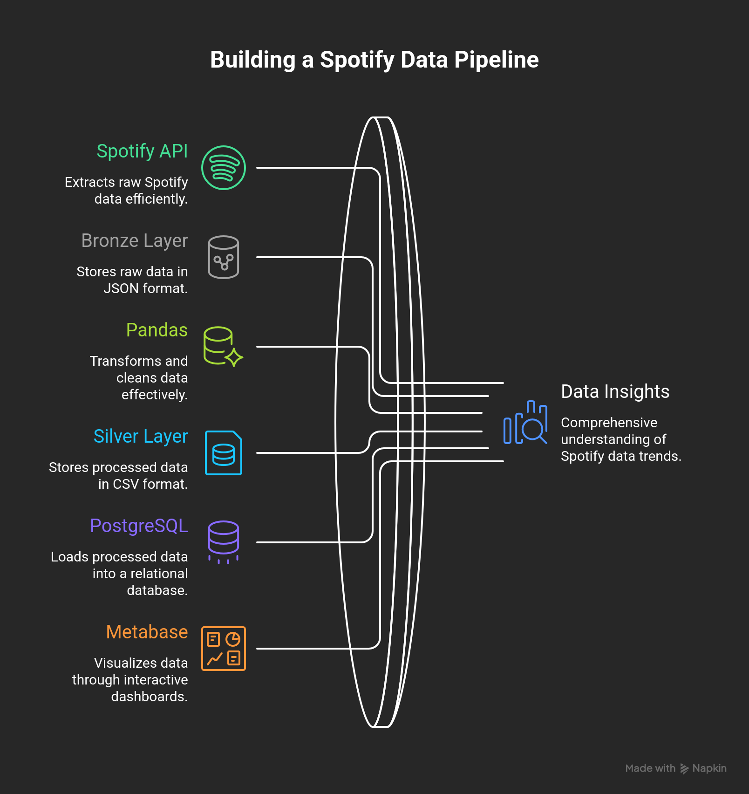
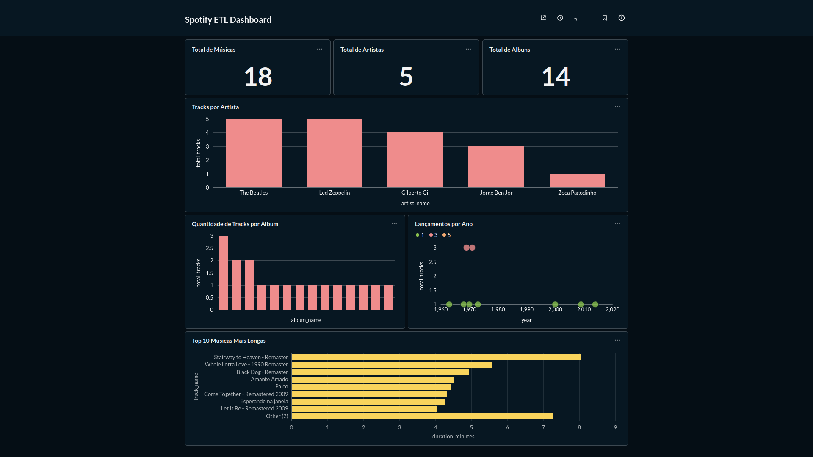

# Spotify ETL Pipeline

Projeto de Engenharia de Dados desenvolvido para extrair dados da Spotify API, processá-los através de um pipeline ETL em Python e disponibilizá-los para análise em PostgreSQL e Metabase.

---

## Objetivo

Desenvolver um pipeline ETL completo utilizando boas práticas de Engenharia de Dados, incluindo:

* Extração de dados via API REST
* Arquitetura em camadas (Bronze e Silver)
* Transformação de dados com Pandas
* Carga incremental em PostgreSQL
* Containerização com Docker e Docker Compose
* Visualização de dados com Metabase

---

## Arquitetura da Solução



O fluxo de dados segue as seguintes etapas:

```text
Spotify API
    ↓
Extract Layer (Python)
    ↓
Bronze Layer (JSON)
    ↓
Transform Layer (Pandas)
    ↓
Silver Layer (CSV)
    ↓
Load Layer
    ↓
PostgreSQL
    ↓
Incremental Load (track_id)
    ↓
Metabase Dashboards
```

---

## Funcionalidades

* Extração de dados da Spotify API
* Armazenamento dos dados brutos na camada Bronze (JSON)
* Transformação e tratamento dos dados com Pandas
* Armazenamento dos dados tratados na camada Silver (CSV)
* Carga dos dados para PostgreSQL
* Implementação de carga incremental utilizando `track_id`
* Containerização completa com Docker e Docker Compose
* Monitoramento através de logs
* Visualização dos dados através do Metabase

---

## Dashboard Analítico



O dashboard desenvolvido no Metabase permite acompanhar indicadores e análises sobre os dados extraídos da Spotify API, incluindo:

* Quantidade de músicas por artista
* Quantidade de músicas por álbum
* Duração média das músicas por artista
* Top músicas por duração
* Indicadores gerais da base de dados

---

## Estrutura do Projeto


```text
spotify-etl/
│
├── app/
│   ├── extract.py
│   ├── transform.py
│   ├── load.py
│   ├── main.py
│   ├── config.py
│   ├── constants.py
│   └── logger.py
│
├── data/
│   ├── bronze/
│   └── silver/
│
├── imagens/
│   ├── architecture-diagram.png
│   ├── dashboard-overview.png
│   └── project-structure.png
│
├── Dockerfile
├── docker-compose.yml
├── requirements.txt
├── .env.example
├── .gitignore
└── README.md
```

---

## Tecnologias Utilizadas

* Python
* Pandas
* Spotipy
* PostgreSQL
* SQLAlchemy
* Docker
* Docker Compose
* Metabase
* Logging
* Git
* GitHub

---

## Artistas Utilizados

* The Beatles
* Led Zeppelin
* Gilberto Gil
* Jorge Ben Jor
* Zeca Pagodinho

---

## Execução do Projeto

### 1. Clonar o repositório

```bash
git clone <url-do-repositorio>
cd spotify-etl
```

### 2. Configurar variáveis de ambiente

Crie um arquivo `.env` utilizando o modelo abaixo:

```env
SPOTIFY_CLIENT_ID=
SPOTIFY_CLIENT_SECRET=

DB_USER=admin
DB_PASSWORD=admin
DB_HOST=postgres
DB_PORT=5432
DB_NAME=spotify
```

### 3. Executar com Docker

```bash
docker compose up --build
```

### 4. Acessar o Metabase

```text
http://localhost:3000
```

---

## Carga Incremental

O projeto implementa uma estratégia de carga incremental baseada no campo `track_id`, identificador único fornecido pela Spotify API.

Antes da carga no PostgreSQL, os registros existentes são consultados e comparados com os dados extraídos. Apenas músicas ainda não presentes na base são inseridas, evitando duplicidades e reduzindo o volume de processamento.

---

## Aprendizados

Durante o desenvolvimento deste projeto foram aplicados conceitos de:

* Engenharia de Dados
* ETL (Extract, Transform and Load)
* Consumo de APIs REST
* Manipulação de dados com Pandas
* Persistência em PostgreSQL
* Docker e Docker Compose
* Arquitetura em camadas (Bronze e Silver)
* Carga incremental
* Observabilidade através de logs
* Visualização de dados com Metabase

---

## Autor

**Diogo Barroso**

Projeto desenvolvido para estudos e construção de portfólio em Engenharia de Dados.
